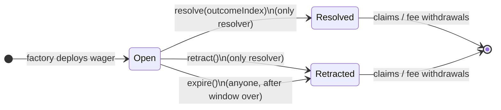
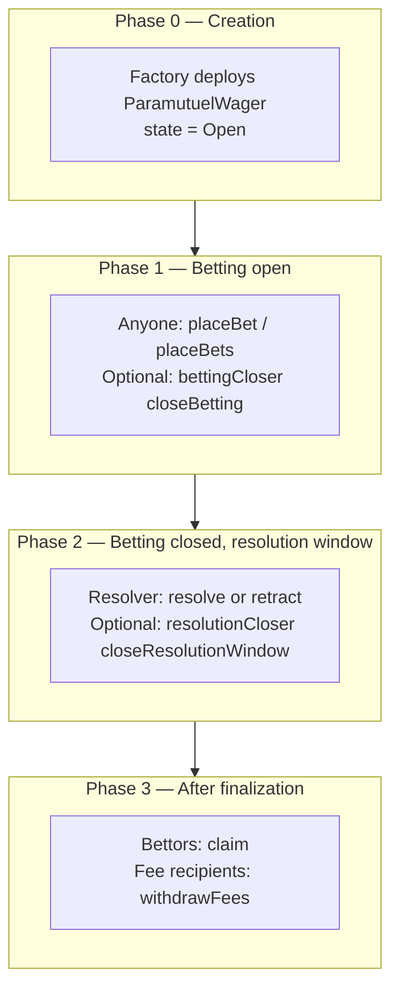
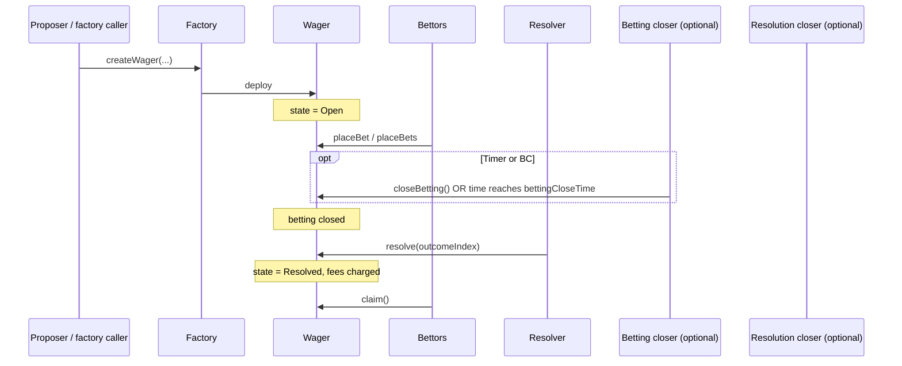

# Wager lifecycle, roles, and state transitions

This document is the **canonical technical reference** for how a `ParamutuelWager` moves from creation through finalization on-chain. It complements the contract source (`src/ParamutuelWager.sol`, `src/ParamutuelFactory.sol`), [`docs/MACHINE.md`](MACHINE.md) (ABI and API surfaces), and [`docs/PAYOUT-CALCULATION.md`](PAYOUT-CALCULATION.md) (economics after finalization).

**Architecture note:** Resolution is **per-wager**. Roles are **immutable** after deployment (except that the factory fixes `resolver` at zero to mean “use proposer”). See [ADR-0005](../research/adr/ADR-0005-delegated-betting-and-resolution-window-closure.md) for the rationale behind optional closers and window semantics.

---

## 1. On-chain states

The wager uses a single enum (`ParamutuelWager.State`):

| State | Meaning |
|--------|---------|
| **Open** | Wager exists; may accept bets (if betting not yet closed); not finalized. |
| **Resolved** | Resolver chose a winning outcome index; winners may **claim**; fees charged once. |
| **Retracted** | Wager invalidated: either **`retract()`** by resolver or **`expire()`** by anyone after the resolution window ended without resolve/retract; bettors may **claim** pro-rata refunds (net of fees). |

There is **no** separate “expired” state: **`expire()`** sets **`state = Retracted`** (same as `retract()` for claim semantics).

---

## 2. Roles (immutable per wager)

| Role | On-chain field | Set at creation | Principal capabilities |
|------|----------------|-----------------|-------------------------|
| **Factory** | `factory` | Always the deploying factory | Not a user role for day-to-day UX; enforces `seedInitialBetsFromFactory` caller. |
| **Proposer** | `proposer` | `createWager` caller (via factory) | Transparency / attribution; **not** automatically authorized to resolve unless also **`resolver`**. |
| **Resolver** | `resolver` | Argument to `createWager`, or **proposer** if argument is `address(0)` | **`resolve(uint256)`**, **`retract()`** (while resolution window open). |
| **Betting closer** | `bettingCloser` | Argument; `address(0)` disables role | **`closeBetting()`** — ends betting early (idempotent). |
| **Resolution closer** | `resolutionCloser` | Argument; `address(0)` disables role | **`closeResolutionWindow()`** — ends resolver window early after betting is closed (idempotent). |
| **Bettor** | (any address) | — | **`placeBet` / `placeBets`** while Open and betting open; **`claim`** after finalization. |
| **Anyone** | — | — | **`expire()`** when allowed (see §5). |

**Factory resolution of zero resolver** (`ParamutuelFactory`): if `resolver == address(0)`, the stored **`resolver`** on the wager is the **`msg.sender`** of `createWager` (the proposer). Documented in factory NatSpec and [`README.md`](../README.md).

---

## 3. Phases (logical timeline)

Phases are **not** extra enum values; they describe **which guards** apply to function calls.

---

## 4. When does betting close? (timer vs role)

Betting is **closed** when **`_bettingClosed()`** is true:

- **Timer:** `bettingCloseTime != 0` **and** `block.timestamp >= bettingCloseTime`.
- **Role (earlier):** **`bettingCloser`** called **`closeBetting()`** before the timer (or when `bettingCloseTime == 0`). Sets `bettingClosedByAuthority` and `bettingClosedAtByAuthority`.

**Whichever happens first** ends betting for timing purposes (see `_bettingClosedAt()`).

| `bettingCloseTime` | Who can end betting |
|--------------------|---------------------|
| **> 0** | Time at `bettingCloseTime`, **or** `bettingCloser` early via `closeBetting()`. |
| **== 0** (“no max” betting window) | **Only** `bettingCloser` via `closeBetting()` (timer never applies). The factory **`revert`s** if `bettingCloseTime == 0 && bettingCloser == address(0)` (`InvalidLifecycleConfig`) so betting cannot stay open forever with no closer. |

---

## 5. Resolution window: open, closed, and expire

After betting is closed, the **resolution window** governs **`resolve`** / **`retract`** vs **`expire`**.

### 5.1 Window “open” (`_resolutionWindowOpen()`)

Resolver may call **`resolve`** or **`retract`** only when:

- `state == Open`,
- **`_bettingClosed()`** is true,
- **`_resolutionWindowOpen()`** is true.

**`_resolutionWindowOpen()`** is false if:

- **`resolutionCloser`** has called **`closeResolutionWindow()`** (`resolutionWindowClosedByAuthority`), **or**
- `resolutionWindow > 0` and `block.timestamp > bettingClosedAt + resolutionWindow` (timer elapsed), **or**
- `resolutionWindow > 0` but betting is not yet closed (`_bettingClosedAt() == 0`).

If **`resolutionWindow == 0`** (“no max” resolution window) and authority has **not** closed the window, **`_resolutionWindowOpen()`** returns **true** once betting is closed — resolver is not bounded by a **duration** until **`closeResolutionWindow()`** is called. The factory requires **`resolutionCloser != address(0)`** when `resolutionWindow == 0` (`InvalidLifecycleConfig`) so the window can always be ended on-chain.

### 5.2 Window “over” (`_resolutionWindowOver()`)

**`expire()`** requires **`_resolutionWindowOver()`** true:

- If **`resolutionWindowClosedByAuthority`** → over (immediately for purpose of `expire`).
- If **`resolutionWindow == 0`** → **not** over by timer alone; **`expire()`** is **not** callable until **`resolutionCloser`** ends the window (unless another design changes in a future version — current v1 behavior in `src/ParamutuelWager.sol`).
- If **`resolutionWindow > 0`** → over when `block.timestamp > bettingClosedAt + resolutionWindow`.

### 5.3 Summary table: finalization paths

| Transition | Callable by | Trigger type | Preconditions (simplified) |
|------------|-------------|--------------|----------------------------|
| **→ Resolved** | `resolver` | **Role** | Betting closed; resolution window open; valid outcome index. |
| **→ Retracted** | `resolver` | **Role** | Betting closed; resolution window open. |
| **→ Retracted** | **Anyone** | **Timer** (and/or prior **role** closing window) | Betting closed; resolution window over per §5.2; still Open. |

Fees are charged **once** on first finalization path (`_chargeFeesOnce()`): **`resolve`**, **`retract`**, or **`expire`**.

---

## 6. State transition matrix

Contract **`state`** only has three values. Rows: **from**; columns: how you **leave** that state.

| From | To | Mechanism | Actor | Clock / authority |
|------|-----|-----------|-------|---------------------|
| Open | Open | (no transition) | — | N/A |
| Open | Resolved | `resolve(i)` | **Resolver** | After betting closed; before resolution window closes |
| Open | Retracted | `retract()` | **Resolver** | After betting closed; before resolution window closes |
| Open | Retracted | `expire()` | **Anyone** | After betting closed; resolution window over |
| Resolved | — | (terminal for state enum) | — | Claims / withdrawals only |
| Retracted | — | (terminal for state enum) | — | Claims / withdrawals only |

**Authority transitions (no state change):**

- **`closeBetting()`** — `bettingCloser`; records authority betting close time; does **not** change `state`.
- **`closeResolutionWindow()`** — `resolutionCloser`; closes resolver window early; does **not** change `state` until someone calls **`resolve` / `retract` / `expire`**.

---

## 7. Sequence: happy path vs liveness

### 7.1 Happy path (resolve)

### 7.2 Invalidation by resolver (retract)

Same as §7.1 until betting closed; **resolver** calls **`retract()`** instead of **`resolve`**. **→ Retracted**, fees charged; bettors **claim** refunds (per payout doc).

### 7.3 Liveness (expire)

If **resolver** never **`resolve`** / **`retract`** and the resolution window ends (timer and/or **`closeResolutionWindow`**), **any** account may **`expire()`**. **→ Retracted**, fees charged; same refund-claim pattern as retract.

---

## 8. Claims and fees (post-transition)

Not state transitions, but **user-visible outcomes**:

- **`claim()`**: after **Resolved** (winners) or **Retracted** (pro-rata refunds). See [`PAYOUT-CALCULATION.md`](PAYOUT-CALCULATION.md).
- **`withdrawFees()`**: fee recipients withdraw accrued balances after fees were charged at finalization.

---

## 9. Indexer / off-chain mapping

The indexer exposes wager **`state`** as strings `OPEN`, `RESOLVED`, `RETRACTED`. Expired wagers appear as **`RETRACTED`**. Sweeper / **`expire`-candidate** logic uses betting close time, `resolution_window`, authority flags, and chain time — see [`docs/MACHINE.md`](MACHINE.md) and ADR-0005.

---

## 10. Related documents

| Document | Relevance |
|----------|-----------|
| [`README.md`](../README.md) | MVP narrative, actor list, numbered lifecycle. |
| [`docs/MACHINE.md`](MACHINE.md) | ABI-level function list, errors, HTTP API. |
| [`docs/WORKFLOWS.md`](WORKFLOWS.md) | `cast` examples for operators. |
| [`docs/PAYOUT-CALCULATION.md`](PAYOUT-CALCULATION.md) | Pot and claims math. |
| [`research/adr/ADR-0005`](../research/adr/ADR-0005-delegated-betting-and-resolution-window-closure.md) | Closer roles and window closure. |
| [`docs/TESTNET-REHEARSAL.md`](TESTNET-REHEARSAL.md) | Multi-scenario certification matrix. |

---

## 11. Source of truth

If this document disagrees with deployed bytecode, **`src/ParamutuelWager.sol`** and **`src/ParamutuelFactory.sol`** govern behavior. Update this file when changing finalization or window semantics.
